### 2.1. Original code of broadcast chat

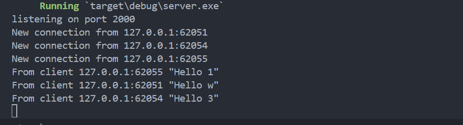 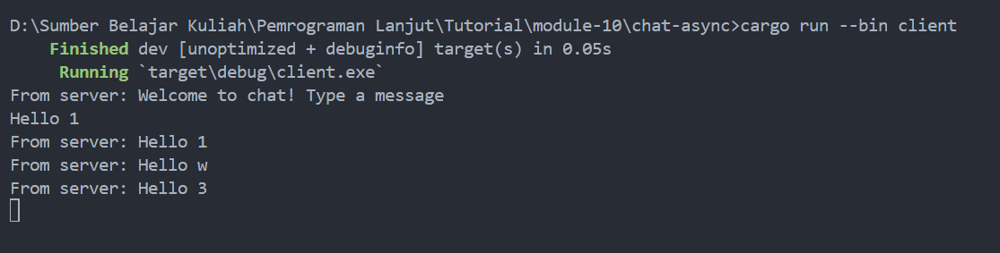 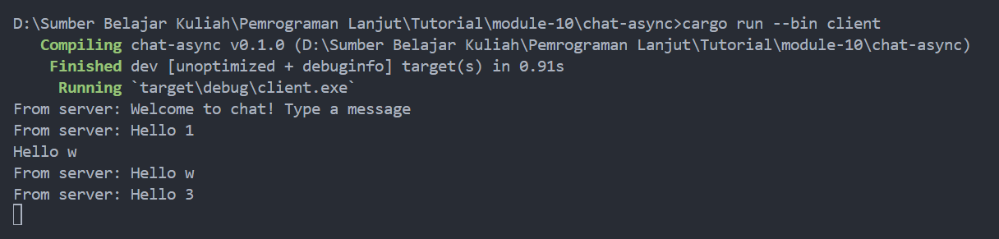 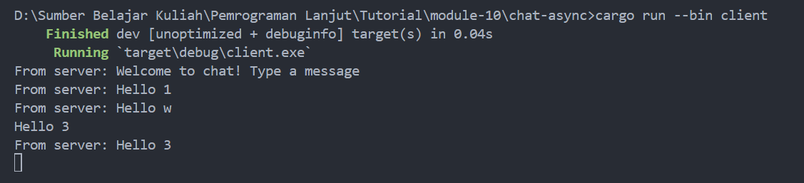

Berdasarkan gambar-gambar diatas, dijalankan sebuah server dan tiga buah client. Server dijalankan dengan menggunakan perintah `cargo run --bin server`, sementara client dijalankan dengan perintah `cargo run --bin client`. Saat salah satu client mengirimkan pesan ke server, maka pesan tersebut akan diteruskan atau di-*broadcas* ke semua client yang terkoneksi pada server yang sama. Client yang menerima pesan broadcast akan menerima pesan dengan pola "From server: {isi pesan}". 

### 2.2. Modifying the websocket port

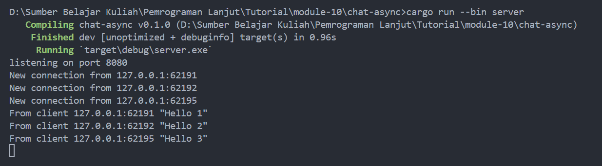 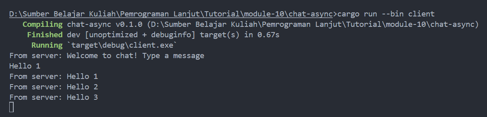 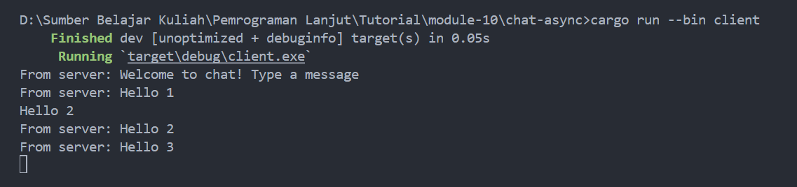 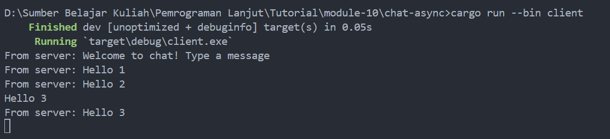

Pada gambar diatas, port pada client dan server diatur sama. Hasilnya program berjalan dengan normal seperti sebelumnya.

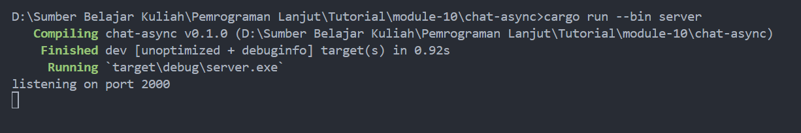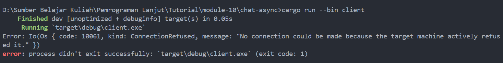

Akan tetapi, jika port pada client dan server berbeda, misalnya hanya karena mengganti port pada client, maka akan terjadi error pada client. Hal ini karena tidak ada koneksi yang bisa dilakukan oleh client pada websocket connection yang telah ditetapkan. Hal ini akan menghasilkan program *crash* seperti gambar diatas.

### 2.3. Small changes. Add some information to client

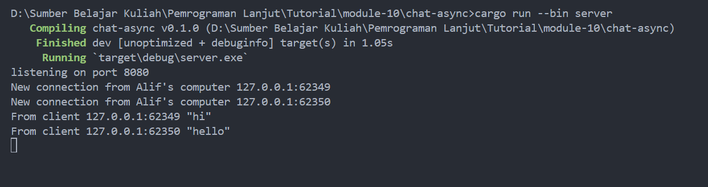 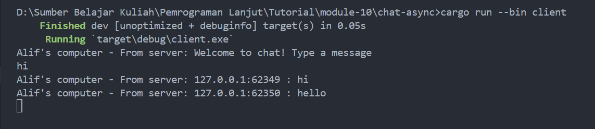 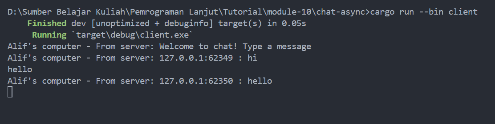

Pada gambar diatas, terlihat bahwa pesan yang di-*broadcast* juga diperlihatkan IP dan PORT dari pengirimnya. Hal ini dapat dilakukan dengan mengubah `bcast_tx.send(text.into())?;` pada `server.rs` menjadi `bcast_tx.send(format!("{addr} : {text}"))?;` sehingga informasi addr yang berisi IP dan PORT pengirim juga dikirimkan dalam isi pesan *broadcast*.